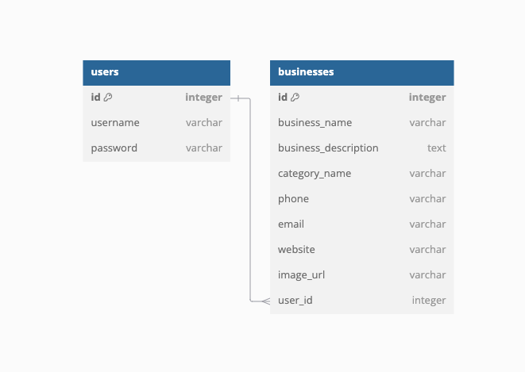

<h1 align="center" style="font-size:40px; font-family:serif;">Carway Connect - Local Business Directory</h1>

[Deployed website can be found on Heroku](https://carway-connect-82b96e1182b2.herokuapp.com/)

This is my local business directory website, designed with a focus on ease of use and modern aesthetics. The site was developed using the responsive framework [Bootstrap](https://getbootstrap.com/), and is crafted with [HTML5](https://en.wikipedia.org/wiki/HTML), [CSS3](https://en.wikipedia.org/wiki/CSS), and [JavaScript](https://www.w3schools.com/js/) to ensure a smooth and engaging user experience.

To enhance the site’s visual appeal, I’ve incorporated [Google Fonts](https://fonts.google.com/) and [Font Awesome](https://fontawesome.com/) for stylish typography and icons. The interactive elements are powered by [jQuery](https://jquery.com/), while [Python](https://www.python.org/) and [Flask](https://github.com/pallets/flask) manage the backend functionality. [SQLAlchemy](https://www.sqlalchemy.org/) and [psycopg2](https://www.psycopg.org/docs/) are used for database management with [PostgreSQL](https://www.postgresql.org/), and the site is deployed on [Heroku](https://www.heroku.com/home), ensuring reliable performance and scalability.

Version control is handled with [Git](https://git-scm.com/) and [GitHub](https://github.com/), keeping development smooth and collaborative.

## About

### Overview

This local business directory has been designed to be the go-to resource for discovering and connecting with businesses in your area. The platform is designed to make finding local services easy and efficient, whether you're looking for a new restaurant, a reliable mechanic, or a trusted nail technician.

### How It Works

#### Business Listings

 The directory features detailed listings of local businesses across various categories. Each listing includes essential information such as business name, contact details and services offered

### Key Features

- Comprehensive Listings: Browse a wide range of businesses with comprehensive details including descriptions and contact information
- Easy Registration and Business Sharing: Create an account quickly and easily to add and manage your own business listings. Share your business with the local community and keep your information updated.
- Responsive Design: The site is built with Bootstrap and modern web technologies to ensure it looks great and functions seamlessly on any device.
- Easy Navigation: With user-friendly design and intuitive navigation, finding the right business and managing your listings quickly.

## Table of Contents

- [UX (User Experience) Design](#ux-user-experience-design)
  - [Strategy](#strategy)
  - [Scope](#scope)
  - [Structure](#structure)
  - [Skeleton](#skeleton)
  - [Surface](#surface)
- [Features](#features)
- [Technologies Used](#technologies-used)
- [Testing](#testing)
- [Deployment](#deployment)
- [Credits](#credits)
  - [Media](#media)
  - [Code](#code)
  - [Acknowledgements](#acknowledgements)

## UX (User Experience) Design

### Strategy

#### My Objectives

The goal of this project is to develop an intuitive and functional local business directory that allows users to easily find and share information about businesses in their area, while demonstrating my proficiency in full-stack web development.

#### User Stories

As a user of the local business directory, I want to:

- Register an account easily and log in securely.
- Add my own business and provide detailed information, including contact details, descriptions, and a website link.
- Search for businesses that fit my needs
- Edit or delete my own business listings.
- Navigate the website effortlessly, with clear layouts and easy-to-use features.

Strategy: This business directory is designed to offer a simple yet effective platform for users to discover and share information about local businesses. The focus is on creating a user-friendly experience with a streamlined registration process and a simple business submission. The layout is intuitive, ensuring that users can quickly access the information they need.

### Scope

#### Functions, Features & Content

- Business Listings: A simple and organised layout displaying a list of local businesses with essential information such as name, category, contact details, and descriptions.
-User Accounts: Easy registration and login functionality for users to create accounts and manage their business listings.
- Business Submission: Users can easily submit their own business with key details like phone number, email, website, and a brief description.
- Business Management: Registered users can edit or delete their own business listings, keeping the directory up to date.
- Mobile Responsive Design: The layout is optimised for all devices, ensuring a smooth experience on desktops, tablets, and smartphones.

Throughout the development process, the focus remains on providing a seamless experience for users to explore, register, and manage local business listings. The features are designed to be intuitive, allowing users to navigate and interact with the platform effortlessly.

### Structure

#### Home / Directory Page

- When users land on the homepage, they are greeted with a clear and welcoming directory layout.
This page prominently features a list of local businesses with key information such as business names, categories, and contact details.

#### Sign-In Page

- The sign-in page offers a clean, straightforward interface where users can enter their credentials to access their accounts.
- The page includes fields for username and password, along with a clear call-to-action to either log in or navigate to the registration page.

#### Registration Page

- The registration page allows new users to create an account by filling in basic details such as username, password.
- Simple and intuitive, the layout ensures the registration process is quick and easy, encouraging more users to join the platform.

#### Profile Dashboard

- Once logged in, users are taken to their profile dashboard, where they can manage their business listings.
- The dashboard includes a summary of their submitted businesses and options to edit or delete their listings.
A prominent button allows users to easily add new businesses to the directory.
- From here the user also has the option to sign out or delete their account.

#### Add Business Page

- The add business page provides a form where users can submit new businesses to the directory.
Fields include business name, category, contact information (phone, email, website), description, and an option to upload an image.
- The page is designed for ease of use, allowing users to quickly add their businesses without hassle.

#### Edit Business Page

- This page allows users to modify their existing business listings.
- Pre-filled fields with the current business information ensure users can make changes easily.
- After editing, users can save their changes with a single click, updating their listings in real-time.

#### Navigation and Layout

- The overall layout of the site is designed with simplicity and usability in mind, ensuring users can navigate through the directory, sign in, register, and manage their listings with ease.
- Every page features a responsive design, ensuring that the experience is seamless across desktops, tablets, and smartphones.

#### Database

This is a visual representation of the database used for the local business directory. The database consists of two core models: Users and Businesses. Each model is designed to maintain simplicity while ensuring flexibility for future enhancements.

Users: This table stores user information, including usernames and encrypted passwords. Each user can manage multiple businesses through a one-to-many relationship.

Businesses: This table holds the details for each business listed in the directory, such as the business name, description, category, contact information (phone, email), website, and image URL. The category is stored directly within the business table as a simple field, which allows easy filtering by type of service.

The database uses PostgreSQL with a relational structure where each business is associated with a user through a user_id foreign key, ensuring data integrity. This schema is designed to allow smooth expansion, such as adding new features like business reviews or social sharing options in the future.

### Skeleton

#### Home / Directory

##### Large Screen Wireframe

[Home / Directory - Large Screen](directory/static/css/images/Wireframes/Home.png)

##### Small Screen Wireframe

[Home / Directory - Small Screen](directory/static/css/images/Wireframes/Home-Small.png)

##### Key Points

- Business Listings Displayed: The homepage immediately shows a list of all businesses available in the directory. Each business entry includes its name and a brief description.
- Navigation Menu: A simple and intuitive navigation menu is visible, allowing users to easily switch between the homepage, sign-in page, registration page, and profile/dashboard once logged in.

## Technologies Used

- [Git](https://git-scm.com/): Version control system
- [Python](https://www.python.org/): Programming language used for backend
- [Flask](https://flask.palletsprojects.com/en/3.0.x/): Web framework
- [SQLAlchemy](https://www.sqlalchemy.org/): ORM library
- [Psycopg2](https://www.psycopg.org/docs/): PostgreSQL adapter
- [HTML](https://en.wikipedia.org/wiki/HTML): Markup language
- [Google Fonts](https://fonts.google.com/): Font Library
- [Bootstrap](https://getbootstrap.com/): Front-end library
- [Font Awesome](https://fontawesome.com/): Icon library
- [CSS](https://en.wikipedia.org/wiki/CSS):Style sheet language
- [AmpWhat](https://www.amp-what.com/#google_vignette): Lookup and reference for Unicode and HTML symbols, entities, and characters
- [JavaScript](https://en.wikipedia.org/wiki/JavaScript): Client side website behavior
- [jQuery](https://jquery.com/): JavaScript library.

## Credits

### Media

- [Smartmockups](https://smartmockups.com/) for the website mockup image used in this README

### Code

- Tutorial on bootstrap navbar, cards, forms and  pagination provided by [W3Schools](https://www.w3schools.com/)
- Documentation on jQuery toggle() function found on [jQuery.com](https://api.jquery.com/toggle/)
- Guide on form validation, including built-in browser validation and custom validation found on [MDN Web Docs](https://developer.mozilla.org/en-US/docs/Learn/Forms/Form_validation)
- Guide for the jQuery find() method provided by [W3Schools](https://www.w3schools.com/jquery/traversing_find.asp)
- Guide on how to use [.preventDefualt()](https://stackoverflow.com/questions/22363838/submit-form-after-calling-e-preventdefault) by user [nnnnnn](https://stackoverflow.com/users/615754/nnnnnn) on [stackoverflow](https://stackoverflow.com/)
- [Python authentication tutorial](https://www.youtube.com/watch?v=Fr2MxT9M0V4) by [Code with Josh](https://www.youtube.com/@codewithjoshoffical)
- Template for Bootstrap modal provided by [W3Schools](https://www.w3schools.com/bootstrap5/bootstrap_modal.php)

### Acknowledgements

- Guidance and tutorial on basic CRUD Flask application provided by [Code Institute](https://codeinstitute.net/)
