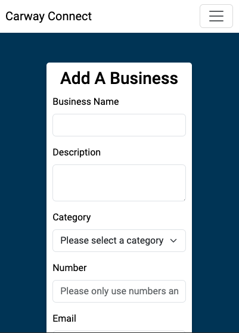

<h1 align="center" style="font-size:40px; font-family:serif;">Carway Connect - Local Business Directory</h1>

[Deployed website can be found on Heroku](https://carway-connect-82b96e1182b2.herokuapp.com/)

This is my local business directory website, designed with a focus on ease of use and modern aesthetics. The site was developed using the responsive framework [Bootstrap](https://getbootstrap.com/), and is crafted with [HTML5](https://en.wikipedia.org/wiki/HTML), [CSS3](https://en.wikipedia.org/wiki/CSS), and [JavaScript](https://www.w3schools.com/js/) to ensure a smooth and engaging user experience.

To enhance the site’s visual appeal, I’ve incorporated [Google Fonts](https://fonts.google.com/) and [Font Awesome](https://fontawesome.com/) for stylish typography and icons. The interactive elements are powered by [jQuery](https://jquery.com/), while [Python](https://www.python.org/) and [Flask](https://github.com/pallets/flask) manage the backend functionality. [SQLAlchemy](https://www.sqlalchemy.org/) and [psycopg2](https://www.psycopg.org/docs/) are used for database management with [PostgreSQL](https://www.postgresql.org/), and the site is deployed on [Heroku](https://www.heroku.com/home), ensuring reliable performance and scalability.

Version control is handled with [Git](https://git-scm.com/) and [GitHub](https://github.com/), keeping development smooth and collaborative.


## About

### Overview

This local business directory has been designed to be the go-to resource for discovering and connecting with businesses in your area. The platform is designed to make finding local services easy and efficient, whether you're looking for a new restaurant, a reliable mechanic, or a trusted nail technician.

### How It Works

#### Business Listings

 The directory features detailed listings of local businesses across various categories. Each listing includes essential information such as business name, contact details and services offered

### Key Features

- Comprehensive Listings: Browse a wide range of businesses with comprehensive details including descriptions and contact information
- Easy Registration and Business Sharing: Create an account quickly and easily to add and manage your own business listings. Share your business with the local community and keep your information updated.
- Responsive Design: The site is built with Bootstrap and modern web technologies to ensure it looks great and functions seamlessly on any device.
- Easy Navigation: With user-friendly design and intuitive navigation, finding the right business and managing your listings quickly.

## Table of Contents

- [UX (User Experience) Design](#ux-user-experience-design)
  - [Strategy](#strategy)
  - [Scope](#scope)
  - [Structure](#structure)
  - [Skeleton](#skeleton)
  - [Surface](#surface)
- [Features](#features)
- [Technologies Used](#technologies-used)
- [Testing](#testing)
- [Deployment](#deployment)
- [Credits](#credits)
  - [Media](#media)
  - [Code](#code)
  - [Acknowledgements](#acknowledgements)

## UX (User Experience) Design

### Strategy

#### My Objectives

The goal of this project is to develop an intuitive and functional local business directory that allows users to easily find and share information about businesses in their area, while demonstrating my proficiency in full-stack web development.

#### User Stories

As a user of the local business directory, I want to:

- Register an account easily and log in securely.
- Add my own business and provide detailed information, including contact details, descriptions, and a website link.
- Search for businesses that fit my needs
- Edit or delete my own business listings.
- Navigate the website effortlessly, with clear layouts and easy-to-use features.

Strategy: This business directory is designed to offer a simple yet effective platform for users to discover and share information about local businesses. The focus is on creating a user-friendly experience with a streamlined registration process and a simple business submission. The layout is intuitive, ensuring that users can quickly access the information they need.

### Scope

#### Functions, Features & Content

- Business Listings: A simple and organised layout displaying a list of local businesses with essential information such as name, category, contact details, and descriptions.
-User Accounts: Easy registration and login functionality for users to create accounts and manage their business listings.
- Business Submission: Users can easily submit their own business with key details like phone number, email, website, and a brief description.
- Business Management: Registered users can edit or delete their own business listings, keeping the directory up to date.
- Mobile Responsive Design: The layout is optimised for all devices, ensuring a smooth experience on desktops, tablets, and smartphones.

Throughout the development process, the focus remains on providing a seamless experience for users to explore, register, and manage local business listings. The features are designed to be intuitive, allowing users to navigate and interact with the platform effortlessly.

### Structure

#### Home / Directory Page

- When users land on the homepage, they are greeted with a clear and welcoming directory layout.
This page prominently features a list of local businesses with key information such as business names, categories, and contact details.

#### Sign-In Page

- The sign-in page offers a clean, straightforward interface where users can enter their credentials to access their accounts.
- The page includes fields for username and password, along with a clear call-to-action to either log in or navigate to the registration page.

#### Registration Page

- The registration page allows new users to create an account by filling in basic details such as username, password.
- Simple and intuitive, the layout ensures the registration process is quick and easy, encouraging more users to join the platform.

#### Profile Dashboard

- Once logged in, users are taken to their profile dashboard, where they can manage their business listings.
- The dashboard includes a summary of their submitted businesses and options to edit or delete their listings.
A prominent button allows users to easily add new businesses to the directory.
- From here the user also has the option to sign out or delete their account.

#### Add Business Page

- The add business page provides a form where users can submit new businesses to the directory.
Fields include business name, category, contact information (phone, email, website), description, and an option to upload an image.
- The page is designed for ease of use, allowing users to quickly add their businesses without hassle.

#### Edit Business Page

- This page allows users to modify their existing business listings.
- Pre-filled fields with the current business information ensure users can make changes easily.
- After editing, users can save their changes with a single click, updating their listings in real-time.

#### Navigation and Layout

- The overall layout of the site is designed with simplicity and usability in mind, ensuring users can navigate through the directory, sign in, register, and manage their listings with ease.
- Every page features a responsive design, ensuring that the experience is seamless across desktops, tablets, and smartphones.

#### Database


This is a visual representation of the database used for the local business directory. The database consists of two core models: Users and Businesses. Each model is designed to maintain simplicity while ensuring flexibility for future enhancements.

Users: This table stores user information, including usernames and encrypted passwords. Each user can manage multiple businesses through a one-to-many relationship.

Businesses: This table holds the details for each business listed in the directory, such as the business name, description, category, contact information (phone, email), website, and image URL. The category is stored directly within the business table as a simple field, which allows easy filtering by type of service.

The database uses PostgreSQL with a relational structure where each business is associated with a user through a user_id foreign key, ensuring data integrity. This schema is designed to allow smooth expansion, such as adding new features like business reviews or social sharing options in the future.

### Skeleton

#### Home / Directory

##### Home / Directory - Large Screen Wireframe

[Home / Directory - Large Screen](directory/static/images/Wireframes/Home.png)

##### Home / Directory - Small Screen Wireframe

[Home / Directory - Small Screen](directory/static/images/Wireframes/Home-Small.png)

##### Key Points

- Business Listings Displayed: The homepage immediately shows a list of all businesses available in the directory. Each business entry includes its name and a brief description.
- Navigation Menu: A simple and intuitive navigation menu is visible, allowing users to easily switch between the homepage, sign-in page, registration page, and profile/dashboard once logged in.

#### Sign In

##### Sign In - Large Screen Wireframe

[Sign in wireframe](directory/static/images/Wireframes/Signin.png)

##### Sign In - Small Screen Wireframe

[Sign in wireframe - small screen](directory/static/images/Wireframes/Signin-Small.png)

##### Key Points

- User Authentication: The sign-in screen provides fields for users to enter their username and password to log in to their accounts.
- Navigation Menu: A simplified navigation bar is present, enabling access to the homepage, registration page for new users, and the main directory for browsing without logging in.
- Sign-In Button: A clearly visible sign-in button allows users to submit their login credentials. When clicked, the credentials are validated, and upon success, the user is redirected to their profile or dashboard.
- Responsive Design: The layout is optimised for both large and small screens, ensuring that the sign-in form remains user-friendly and accessible across different devices.

#### Registration

##### Registration - Large Screen Wireframe

[Registration - large screen wireframe](directory/static/images/Wireframes/Register.png)

##### Registration - Smaller Screen Wireframe

[Registration - smaller screen wireframe](directory/static/images/Wireframes/Register-Small.png)

##### Key Points

- User Input Fields: The registration screen features input fields for users to enter their name, email, and password to create a new account.
- Sign-Up Button: A clearly visible sign-up button is placed below the form fields, allowing users to submit their information and register their account.
- Navigation Menu: The navigation bar includes options to go back to the homepage, sign-in page for existing users, and the directory for browsing without registering.
- Responsive Design: The layout adapts to both large and small screens, ensuring all form fields and buttons are easily accessible on any device.

#### Dashboard / Profile

##### Dashboard - Large Screen Wireframe

[Profile - large screen wireframe](directory/static/images/Wireframes/Profile.png)

##### Dashboard - Small Screen Wireframe

[Profile - small screen wireframe](directory/static/images/Wireframes/Profile-Small.png)

##### Key Points

- Business Management Section: Users can edit, or delete business listings directly from their dashboard.
- Responsive Design: The dashboard layout adapts to both large and small screens, ensuring a user-friendly experience on mobile and desktop devices.

#### Add A Business

##### Add A Business - Large Screen Wireframe

[Add a business - large scree wireframe](directory/static/images/Wireframes/Add.png)

##### Add A Business - Small Screen Wireframe

[Add a business - small screen wireframe](directory/static/images/Wireframes/Add-Small.png)

##### Key Points

- Business Information Input Fields: Users can input key details for the business, such as business name, description, category, contact information, and website URL.
- Business Logo/Image URL Upload: An image url field is available for users to upload the business logo or relevant images.
- Submit Buttons: To submit business information
- Validation & Error Messages: The form provides validation feedback, highlighting any missing or incorrectly formatted information.
- Responsive Design: The form is optimised for both large and small screens, ensuring easy navigation and usability on mobile devices.
- Category Dropdown: A dropdown option allows users to assign their business a category, ensuring it fits within the directory structure.

#### Edit A Business

##### Edit A Business - Large Screen Wireframe

[Edit a business - large screen wireframe](directory/static/images/Wireframes/Edit.png)

##### Edit A Business - Small Screen Wireframe

[Edit a business - small screen wireframe](directory/static/images/Wireframes/Edit-Small.png)

##### Key Points

- Pre-filled Business Information: The form is pre-populated with the existing details of the business, such as name, description, contact information, and website URL, allowing for easy editing.
- Editable Business Logo: Users can view and update the current business logo by uploading a new image url if necessary.
- Category Dropdown: Users can change the business's category by selecting from a dropdown menu.
- Submit Button: Clear options to save changes are provided.
- Form Validation & Error Handling: Validation ensures that changes are properly formatted before submission, with error messages displayed for any issues.
- Responsive Design: The form is fully responsive, adapting for both large desktop screens and smaller mobile devices, ensuring ease of use on all platforms.

### Surface

#### Colours

Background: The primary background colour for the directory is white. This choice creates a bright and neutral canvas that enhances readability and ensures that all content is easily visible. For the forms a dark blue is used to create a contrast between the background and white forms.

Text: For text, either black or white are used. The colour is chosen depending on which one would provide the best readability.

Buttons: Our buttons feature a dynamic colour scheme to engage users. Initially, they have a either a subtle grey or blue background background with either white or black text. Upon hovering, the buttons change background colour. This colour shift not only enhances user interaction but also aligns with our modern, inviting aesthetic.

Overall Palette: The combination of white, vibrant blue ensures that our directory is both visually appealing and easy to navigate. The colours provide a clean and professional look while ensuring that interactive elements stand out effectively.

#### Typography

Navbar: I used the sans-serif Google font "Dosis" for the navbar. This choice makes options prominent and engaging.

Body Text: For the body text, we use the sans-serif Google font "Roboto". This font is selected for its readability and modern feel, ensuring that all textual information is easy to digest and pleasant to read.

Typography Combination: The pairing of "Dosis" for navbar and "Roboto" for body text creates a balanced and professional look. The distinct navbar font draws attention to key sections, while the clean body text maintains readability and a streamlined user experience.

#### Imagery

Business Listings: Each business listing features a logo or image that represents the business. This visual element helps users quickly identify and connect with businesses, enhancing the directory’s usability.

Overall Visual Appeal: The use of clear and relevant images enhances the user experience by making the directory visually engaging and helping users easily identify and differentiate between businesses.

#### Home / Directory

##### Directory - Large Screen


##### Directory - Smaller Screens


#### Sign In

##### Sign In - Large Screen


##### Sign In - Smaller Screen


#### Register

##### Register - Large Screen


##### Register - Smaller Screen


#### Profile

##### Profile - Large Screen


##### Profile - Smaller Screen


#### Add A Business

##### Add Form


##### Add Form - Smaller Screen



#### Edit Form

##### Edit Form


##### Edit Form - Smaller Screen


## Features

### User Interface

- Business Listings Display: Each business listing is displayed clearly with its name, description, and contact information, ensuring users can easily browse and find what they need.

- Navigation Bar: A persistent navigation bar is available on all pages, linking to the Sign In/Register page, Directory, and the user’s Profile/Dashboard. This ensures easy access to key sections of the directory.

- Directory Pagination: The directory page shows all businesses but limits the display to 10 businesses at a time. Users can view additional businesses using the directional arrow keys at the bottom of the screen, providing a streamlined browsing experience that avoids overcrowding.

### Business Interaction

- Contact Information Display: Each business profile includes essential contact details such as email, phone number, and website, making it simple for users to reach out to businesses directly.

- Business Dashboard: Registered business owners have access to a dashboard where they can view, edit, or delete their business listings. The dashboard also allows users to sign out or delete their account if needed.

- Add Business Page: Users can add new business listings through a dedicated page that includes a form for business details such as business name, description, category, email, phone number, website URL, and image URL.

- Edit Business Page: The edit page pre-populates the business details for easy updates, allowing users to modify business information without re-entering everything from scratch.

### Responsiveness

- Mobile-Friendly Interface: The app interface is fully responsive and optimised for mobile, tablet, and desktop use, ensuring that users enjoy a seamless experience across all devices.

- Adaptive Layout: Using media queries and Bootstrap, the directory adapts seamlessly to various screen sizes and orientations, ensuring intuitive navigation on any device.

### Accessibility

- Scalable Text: All text is scalable, with rem units allowing users to adjust the font size to enhance readability, making the directory more accessible for individuals with visual impairments.

### Authentication & User Management

- Sign In Page: The sign-in page features a simple form with two input fields: username and password, allowing users to quickly access their account.

- Register Page: The registration page also includes two inputs for username and password, simplifying the sign-up process for new users.

- Profile/Dashboard: Once logged in, users can access their Profile/Dashboard, which displays their businesses. From here, users can edit or delete their businesses, sign out, or delete their account.

### Business Registration & Management

- Business Dashboard: Local business owners can manage their listings through the dashboard, where they can add, edit, or delete businesses. The add/edit process is streamlined through a simple form that includes fields for business name, description, category, email, phone number, website URL, and image URL.

### Future Features

- Search Bar: Add a powerful search bar at the top of the directory to enable users to quickly find specific businesses or categories through keyword searches.

- Category Filter: Implement a category filter that allows users to explore businesses based on interests or needs, such as Restaurants, Health & Wellness, and Professional Services.

- Business Map View: Introduce an interactive map feature that displays the locations of all listed businesses, helping users visualise nearby options or explore businesses in specific areas.

- Favorite Button: Provide a "Favorite" button that allows users to save businesses for quick reference, enabling them to easily revisit their preferred listings.

- One-Tap Calling and Emailing: Integrate one-tap functionality, allowing users to call or email businesses directly from their profile, streamlining communication.

- Website Links: Include direct links to each business's website within their profile, giving users instant access to more detailed information or online services.

- Leave a Review: Allow registered users to leave reviews and ratings for businesses they’ve interacted with, encouraging community engagement and informed decision-making.

- High-Contrast Mode: Add a high-contrast mode to improve visibility and accessibility for users with visual impairments or color blindness.

- Voice Search: Incorporate a voice search feature, enabling users to find businesses hands-free, which enhances convenience for those with mobility challenges.

- Backend Pagination Functionality: I'd like to move pagination to the backend as that prevents loading all businesses from the database unless the user wants to look at them

- Backend From Validation: - HTML validation is not ideal and in a future release there would be full backend validation. If the HTML validation rules are tampered with, this does not pose a security risk and the only adverse effect is the database validation results in a server error.

## Technologies Used

- [Git](https://git-scm.com/): Version control system
- [Python](https://www.python.org/): Programming language used for backend
- [Flask](https://flask.palletsprojects.com/en/3.0.x/): Web framework
- [SQLAlchemy](https://www.sqlalchemy.org/): ORM library
- [Psycopg2](https://www.psycopg.org/docs/): PostgreSQL adapter
- [HTML](https://en.wikipedia.org/wiki/HTML): Markup language
- [Google Fonts](https://fonts.google.com/): Font Library
- [Bootstrap](https://getbootstrap.com/): Front-end library
- [Font Awesome](https://fontawesome.com/): Icon library
- [CSS](https://en.wikipedia.org/wiki/CSS):Style sheet language
- [AmpWhat](https://www.amp-what.com/#google_vignette): Lookup and reference for Unicode and HTML symbols, entities, and characters
- [JavaScript](https://en.wikipedia.org/wiki/JavaScript): Client side website behavior
- [jQuery](https://jquery.com/): JavaScript library.
- [PostgreSQL](https://www.postgresql.org/): Relational database management system.
- [Heroku](https://www.heroku.com/home): App hosting.
- [dbdiagram.io](https://dbdiagram.io/d): Entity-relationship diagram builder
- [Gitpod IDE](https://www.gitpod.io/): Online Integrated development environment
- [Jinja](https://jinja.palletsprojects.com/en/2.11.x/): Templating language

## Testing

| Test Description | Expected Outcome | Outcome | Action | Re-test |
| --- | --- | --- | --- | --- |
| Responsiveness on smaller screens | Business listings, pagination, and navbar should stack in a single column. | Passed | N/A | N/A |
| Responsiveness on medium screens | Business listings should appear in a two-column layout, with pagination and navbar displaying appropriately. | Passed | N/A | N/A |
| Responsiveness on large screens | Business listings should appear in a four-column layout, and elements like pagination and navbar should display clearly. | Failed. Listings displayed in three columns instead of four. | Media queries were adjusted to allow listings to fit into three columns. | Passed |
| Responsiveness on extra-large screens | Text, buttons, and business images should scale proportionally to larger screens. | Passed | N/A | N/A |
| Pagination | Only 10 business listings should display at once, with directional arrows functioning to load the next set. | Passed | N/A | N/A |
| Sign In Functionality | Users should be able to sign in using their username and password, redirecting to their dashboard. | Passed | N/A | N/A |
| Register Functionality | Users should be able to create an account with a username and password and redirected to their dashboard. | Passed | N/A | N/A |
| Add Business Functionality | Registered users can add business details including name, description, category, contact info, and image. Information should appear correctly in the directory. | Failed. Image URL wasn't properly saving. | Form validation was adjusted to ensure image URLs save correctly. | Passed |
| Edit Business Functionality | Business details should prepopulate in the form, allowing users to update details without re-entering all fields. | Failed. Category colume doesn't pre-populate. | Unable to fix at the time of writing | Failed |
| Delete Business Functionality | Registered users should be able to delete their businesses, removing them from the directory. | Passed | N/A | N/A |
| Delete User Functionality | Registered users should be able to delete their account, removing them and all their businesses from the directory. | Passed | N/A | N/A |
| Dashboard Display | The user's businesses should be displayed on their dashboard, with options to edit or delete. | Passed | N/A | N/A |
| Deletion Confirmation Modals | When a registered user tries to delete a business or their profile, they should be greeted with a confirmation modal | Passed | N/A | N/A |
| Browser Compatibility | Tested website using browsers Firefox, Safari, Chrome and Edge. All above tests should pass. | Passed | N/A | N/A |
|Colours| The colour contrast should score at least 14 according to [Coolors](https://coolors.co/contrast-checker/000000-ffd700) | Passed | N/A | N/A |
|Performance| The website performance score should be at least 80 according to [PageSpeed Insights](https://pagespeed.web.dev/) on both mobile and desktop| Passed | N/A | N/A |


### Testing User Stories

### Testing User Stories

>- Register an account easily and log in securely.

The registration and login processes are simple and secure. The sign-up form has only two required fields: username and password, ensuring quick registration. User data is encrypted for security, and login redirects the user to their dashboard. Extensive testing confirms the security and functionality of this process.

>- Add my own business and provide detailed information, including contact details, descriptions, and a website link.

Registered users can add a business through a user-friendly form that captures essential details like name, description, category, contact info, and a website URL. Information is saved to the directory and displayed correctly. Form validation ensures accurate data entry, and tests confirm that businesses are added and displayed successfully.

>- Search for businesses that fit my needs.

(Future Feature) The directory will include a search bar at the top of the page, allowing users to search businesses by name or category. This feature will be responsive, with relevant results displayed based on user input. Once implemented, tests will ensure that the search filters work accurately and provide users with the desired results.

>- Edit or delete my own business listings.

Users can edit or delete their businesses directly from their dashboard. The edit functionality pre-populates the form with existing business details, making it easy to update information. Tests confirm that changes are saved correctly, and deleted businesses are removed from the directory without issues.

>- Navigate the website effortlessly, with clear layouts and easy-to-use features.

The website features an intuitive and responsive design. Navigation is straightforward with a clear, consistent layout. The navbar provides links to all essential pages, and the pagination ensures that business listings are displayed in an organised manner. Testing across multiple devices confirms a seamless experience.


### Code Validation

#### HTML

HTML was validated using [Markup Validation Service](https://validator.w3.org)


#### CSS

CSS was validated using [The W3C CSS Validation Services](https://jigsaw.w3.org/css-validator/)


#### JavaScript

JavaScript was validated using [JSHint](https://jshint.com)


## Deployment

This project was developed  using a mixture of IDEs, committed to git initially using the PCs built-in terminal and then eventually [GitHub Desktop](https://desktop.github.com/).

The IDEs used were:

- [Atom](https://atom-editor.cc/) Used primarily to edit the README.md becuase of it built-in markdown preview
- [Sublime Text](https://www.sublimetext.com/index2) Used to edit HTML, CSS and JS.

### Deploying from GitHub

1. Log into GitHub account.
2. Go to your repositories and select BlackJack-Game.
3. At the top of the screen you'll find "Settings" in the same navigation bar as "Code", "Issues" etc.
4. Open "Pages".
5. Under "Build and deployment", change source to "Deploy from a branch".
6. Under branch select "Main" / whichever branch is the most up to date and working, select the "root" folder and click the save button.
7. Refresh the page and eventually at the top a URL will be generate.
8. Click "Visit site" to view website.

### Running The Project Locally

1. At the top of this repository click "<> Code",then "local", then "clone", "HTTPS" and copy the URL.
2. In your IDE of choice, change to your preferred  working directory, open the Git Bash and type:

```
git clone <repository-url>
```
3. Hit enter to clone.

### Forking the Repository

You can create a copy of the repository and make changes without affecting the original repository by forking.

Click the "fork" button at the top of the GitHub repository and a copy of the repository will be saved in your account.

If the original repository is updated you'll receive a notification.

### Making Updates

After making changes to the code using your preferred IDE, you can commit them using Git.

type the following into your git bash in order to do so:

```
git add .
git commit -m "commit message"
git push origin main
```
## Credits

### Media

- Card images found in [ImKennyYip - black-jack repository](https://github.com/ImKennyYip/black-jack)

### Code

- [The Fisher Yates Method](https://www.w3schools.com/js/js_array_sort.asp) was used to randomise the deck array in my javascript.
- Solution for Jest not recognising Jquery object($) provided by user [jjee](https://stackoverflow.com/users/5830656/jjee) on [stackoverflow](https://stackoverflow.com/questions/72200196/jest-not-recognising-jquery-object)
- Guide on writing JSDoc comments provided by [Brian Macharia](https://bald-swan-bb5.notion.site/JavaScript-60f5c6be428b4bd4874ef888b94597fd)

### Acknowledgements

- General revision on array methods provided by [w3schools.com](https://www.w3schools.com/js/js_array_methods.asp)


## Technologies Used


## Credits

### Media

- [Smartmockups](https://smartmockups.com/) for the website mockup image used in this README

### Code

- Tutorial on bootstrap navbar, cards, forms and  pagination provided by [W3Schools](https://www.w3schools.com/)
- Documentation on jQuery toggle() function found on [jQuery.com](https://api.jquery.com/toggle/)
- Guide on form validation, including built-in browser validation and custom validation found on [MDN Web Docs](https://developer.mozilla.org/en-US/docs/Learn/Forms/Form_validation)
- Guide for the jQuery find() method provided by [W3Schools](https://www.w3schools.com/jquery/traversing_find.asp)
- Guide on how to use [.preventDefualt()](https://stackoverflow.com/questions/22363838/submit-form-after-calling-e-preventdefault) by user [nnnnnn](https://stackoverflow.com/users/615754/nnnnnn) on [stackoverflow](https://stackoverflow.com/)
- [Python authentication tutorial](https://www.youtube.com/watch?v=Fr2MxT9M0V4) by [Code with Josh](https://www.youtube.com/@codewithjoshoffical)
- Template for Bootstrap modal provided by [W3Schools](https://www.w3schools.com/bootstrap5/bootstrap_modal.php)

### Acknowledgements

- Guidance and tutorial on basic CRUD Flask application provided by [Code Institute](https://codeinstitute.net/)
